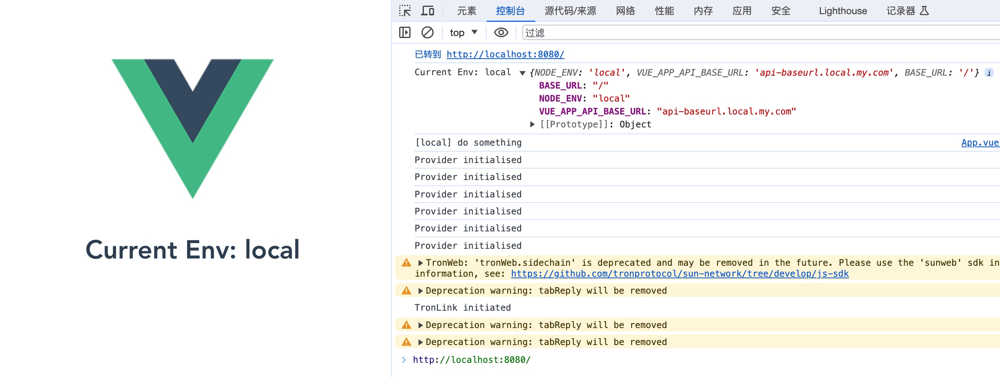
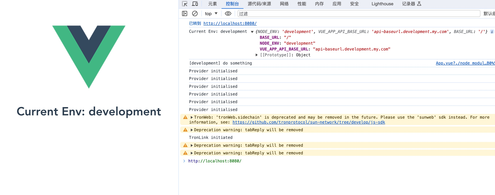
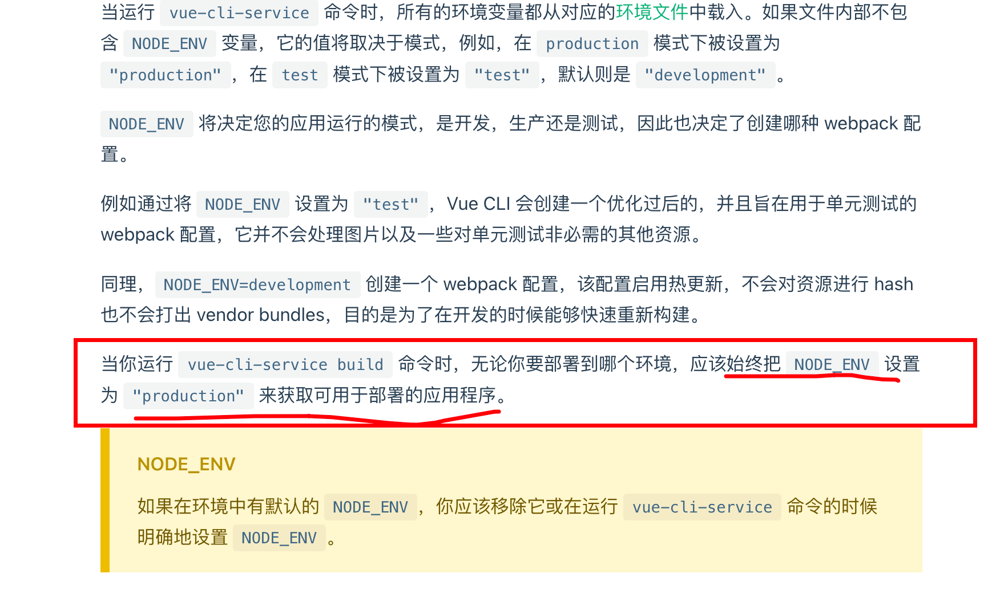

# vuejs-docker-env-vars

优雅解决 Vue.js + dockerfile + docker-compose 环境变量问题示例





## 文件与配置

**环境变量文件配置**

`.env`

```
NODE_ENV=
BASE_URL=baseurl.default.my.com
VUE_APP_API_BASE_URL=api.baseurl.default.my.com
VUE_APP_A=a.default.my.com
```

`.env.local`

```
NODE_ENV=local
BASE_URL=baseurl.local.my.com
VUE_APP_API_BASE_URL=api-baseurl.local.my.com
```

`.env.development`

```
NODE_ENV=development
BASE_URL=baseurl.development.my.com
VUE_APP_API_BASE_URL=api-baseurl.development.my.com
```

`.env.development.local`

```
NODE_ENV=development.local
BASE_URL=baseurl.development-local.my.com
VUE_APP_API_BASE_URL=api-baseurl.development-local.my.com
```

`.env.production`

```
NODE_ENV=production
BASE_URL=baseurl.production.my.com
VUE_APP_API_BASE_URL=api-baseurl.production.my.com
```

`.env.production.local`

```
NODE_ENV=production.local
BASE_URL=baseurl.production-local.my.com
VUE_APP_API_BASE_URL=api-baseurl.production-local.my.com
```

**package.json**

```json
{
  "scripts": {
    "serve": "vue-cli-service serve",
    "build": "vue-cli-service build",
    "build:local": "vue-cli-service build --mode=local",
    "build:development": "vue-cli-service build --mode=development",
    "build:production": "vue-cli-service build --mode=production",
    "lint": "vue-cli-service lint"
  }
}
```

## 本地运行

在程序中打印环境信息

```jsx
console.log(process.env)
```

运行哪个环境，就在参数 `—mode` 指定为哪个环境变量文件名，如下：

- **local** 环境 `yarn serve --mode=local`

  ```json
  {
      "NODE_ENV": "local",
      "VUE_APP_API_BASE_URL": "api-baseurl.local.my.com",
      "VUE_APP_A": "a.default.my.com",
      "BASE_URL": "/"
  }
  ```

- **development** 环境 `yarn serve --mode=development`

  ```json
  {
      "NODE_ENV": "development",
      "VUE_APP_API_BASE_URL": "api-baseurl.development.my.com",
      "VUE_APP_A": "a.default.my.com",
      "BASE_URL": "/"
  }
  ```

- **development.local** 环境 `yarn serve --mode=development.local`

  .local 环境主要是在本地自定义配置，而不提交进 git 中，会比 **development** 优先

  ```json
  {
      "NODE_ENV": "development.local",
      "VUE_APP_API_BASE_URL": "api-baseurl.development-local.my.com",
      "VUE_APP_A": "a.local.my.com",
      "BASE_URL": "/"
  }
  ```

- **production** 环境 `yarn serve --mode=production`

  ```json
  {
      "NODE_ENV": "production",
      "VUE_APP_API_BASE_URL": "api-baseurl.production.my.com",
      "VUE_APP_A": "a.default.my.com",
      "BASE_URL": "/"
  }
  ```

## 构建容器运行

由于采用 **docker-compose** 来构建 `Dockerfile` 文件，忽略了构建阶段环境变量或者参数应该在 `build.args` 中配置，而我一直在 `environment` 中徘徊不能生效问题。

```json
build:
  context: .
  args:
    NODE_ENV: ${NODE_ENV}
```

在容器中构建，使用 `yarn build` 构建，默认 `NODE_ENV=production`，但由于我需要借助 `NODE_ENV` 名称去把指定的环境变量文件生成进静态文件中去。



现在这样能在容器外控制环境变量，达到目的，但与官方的建议【应该始终把 NODE_ENV 设置为 "production" 来获取可用于部署的应用程序。】事与愿违，这样做会不会有坑暂不深究。

### 构建

1. 设置环境变量

   - 如果工作目录下有 `.env` 文件，会读取其中的 `NODE_ENV` 变量

   - 也可以临时手动指定

     ```bash
     export NODE_ENV=local
     ```

   - 如果为空，默认会读取 Dockerfile 中的默认值 `NODE_ENV=production`

     ```docker
     ARG NODE_ENV=production
     ```

2. 开始构建

   ```bash
   docker-compose build
   ```

3. 访问 [localhost:8080](http://localhost:8080) 查看控制台输出

## 开发

可获取 `process.env.NODE_ENV` 进行对应环境判断

```jsx
// local
    if (process.env.NODE_ENV == 'local') {
      console.log('[local] do something')
    }

    // development
    if (process.env.NODE_ENV == 'development') {
      console.log('[development] do something')
    }
    if (process.env.NODE_ENV == 'development.local') {
      console.log('[development.local] do something')
    }

    // production
    if (process.env.NODE_ENV == 'production') {
      console.log('[production] do something')
    }
    if (process.env.NODE_ENV == 'production.local') {
      console.log('[production.local] do something')
    }
```


## Project setup
```
yarn install
```

### Compiles and hot-reloads for development
```
yarn serve
```

### Compiles and minifies for production
```
yarn build
```

### Lints and fixes files
```
yarn lint
```

### Customize configuration
See [Configuration Reference](https://cli.vuejs.org/config/).
